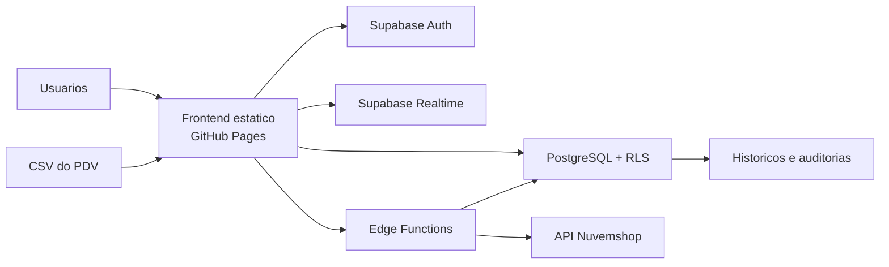
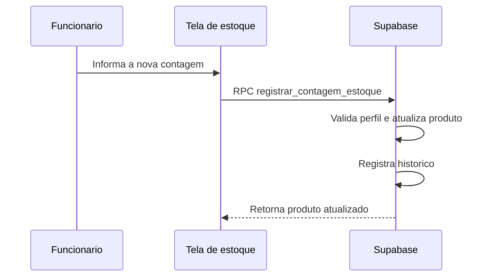
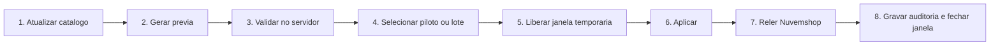

# Arquitetura do Sistema de Estoque

Este documento registra como o sistema esta organizado, quais componentes sao
responsaveis por cada regra e quais cuidados devem orientar a evolucao do
projeto. Ele descreve o estado consolidado em julho de 2026.

## 1. Objetivo e principios

O sistema controla um unico estoque fisico usado pela loja, pelos vendedores e
pelos canais online. Seus principios atuais sao:

1. O Supabase e a fonte de verdade do estoque fisico.
2. Entradas e saidas precisam deixar historico.
3. A interface ajuda o usuario, mas a seguranca e validada no servidor.
4. Operacoes de risco devem ser pequenas, confirmadas e auditaveis.
5. A integracao externa nunca deve escrever sem previa, validacao e liberacao
   temporaria.
6. Mudancas devem ser entregues em branches pequenas, com teste antes do merge.

## 2. Visao geral



### Camadas

| Camada | Tecnologia | Responsabilidade |
| --- | --- | --- |
| Interface | HTML, CSS e JavaScript | Telas, formularios, previas e feedback ao usuario. |
| Autenticacao | Supabase Auth | Sessao e identidade do usuario. |
| Autorizacao | Perfis, RLS e funcoes SQL | Define quem pode ler ou alterar cada dado. |
| Dados | PostgreSQL no Supabase | Estoque, historico, lotes CSV, vinculos e auditorias. |
| Tempo real | Supabase Realtime | Atualiza telas abertas quando o estoque muda. |
| Integracoes | Supabase Edge Functions | OAuth, catalogo, LGPD e sincronizacao Nuvemshop. |
| Hospedagem | GitHub Pages | Publica os arquivos estaticos da `main`. |

## 3. Areas e perfis

### Administracao

Arquivos principais: `admin.html`, `css/admin.css` e `js/admin.js`.

Responsabilidades:

- dashboard e consulta geral;
- cadastro e edicao de produtos;
- separacao entre produtos e maquinas/prensas;
- importacao e baixa por CSV;
- gestao de vendedores;
- historico e notificacoes;
- conferencia, vinculos, previa e sincronizacao Nuvemshop.

### Estoque desktop

Arquivos principais: `funcionario.html`, `css/funcionario.css` e
`js/funcionario.js`.

Interface de escritorio para busca, conferencia e atualizacao das quantidades.
A alteracao e registrada pela funcao segura de contagem, sem `UPDATE` direto do
funcionario na tabela de produtos.

### App Estoque

Arquivos principais: `funcionario-app.html`, `css/funcionario-app.css` e
`js/funcionario-app.js`.

Interface otimizada para celular, com contagem rapida, imagem ampliada,
indicacao de estoque minimo, historico do produto e observacoes.

### Vendedor

Arquivos principais: `vendedor.html`, `css/vendedor.css` e `js/vendedor.js`.

Permite consultar estoque, registrar baixa de maquinas/prensas e consultar as
proprias baixas. Produtos comuns ficam disponiveis para consulta; a baixa manual
deles exige o fluxo protegido definido no Supabase.

### Relatorios

Arquivos principais: `relatorios.html`, `css/relatorios.css` e
`js/relatorios.js`.

Area somente para analise de compras e reposicao. Consolida produtos, maquinas,
estoque baixo, itens zerados, voltagens zeradas e detalhes com fotos, sem ser a
tela principal de movimentacao.

### Perfis

- `admin`: administra cadastros, movimentacoes, relatorios e integracoes.
- `funcionario`: consulta e registra contagens autorizadas.
- `vendedor`: consulta estoque e registra as baixas permitidas.

O perfil efetivo vem de `public.perfis`. As funcoes auxiliares de permissao e as
policies RLS sao documentadas nos primeiros arquivos SQL da pasta `supabase/`.

## 4. Modelo de estoque

### Produtos fisicos

`public.produtos` representa o item fisico controlado pelo sistema. Entre os
campos usados pelo negocio estao nome, imagem, observacoes, minimo, categoria e
codigos de identificacao.

Categorias principais:

- `produto`: consumiveis e mercadorias cuja saida diaria normalmente vem do CSV
  do PDV;
- `maquina`: maquinas e prensas cuja baixa manual identifica o vendedor.

### Voltagens

Maquinas podem ter estoque separado em 110V e 220V. Os codigos de fabricante,
interno, referencia e barras tambem podem ser registrados por voltagem. Assim,
uma variante externa 110V nao e confundida com a variante 220V.

### Historico

`public.historico` centraliza as movimentacoes relevantes. A tela pode mostrar
subconjuntos diferentes, mas o registro principal permanece no banco.

## 5. Fluxos de estoque

### Contagem pelo funcionario



### Baixa de maquina pelo vendedor

A tela chama `registrar_baixa_venda`. O servidor valida o vendedor, a categoria,
a voltagem quando aplicavel e a quantidade disponivel. A operacao atualiza o
estoque e grava o responsavel no historico.

### Baixa diaria de produtos por CSV

1. O administrador escolhe a data do movimento e o arquivo exportado pelo PDV.
2. O navegador interpreta o CSV e monta uma previa.
3. O sistema procura produtos por codigos confiaveis.
4. Maquinas sao ignoradas nesse fluxo.
5. Itens nao encontrados e estoque insuficiente ficam visiveis antes da acao.
6. A funcao segura do Supabase valida novamente e impede estoque negativo.
7. O fechamento gera um lote e seus itens para consulta posterior.
8. A identificacao do fechamento evita reaplicar o mesmo arquivo na mesma data.

O CSV representa o fechamento diario da loja e atualiza o estoque fisico que
sera usado no dia seguinte.

## 6. Integracao Nuvemshop

### Limite de responsabilidade

O sistema local controla a quantidade fisica. A Nuvemshop possui ofertas e
variantes comerciais vinculadas a esse estoque. Um produto local pode alimentar
varias ofertas externas.

### Componentes

| Componente | Responsabilidade |
| --- | --- |
| `nuvemshop-oauth` | Conclui OAuth e guarda o token cifrado. |
| `nuvemshop-lgpd` | Recebe e valida webhooks obrigatorios de privacidade. |
| `nuvemshop-catalogo` | Consulta catalogo e identifica o local de estoque. |
| `nuvemshop-sincronizacao` | Simula, valida e executa escritas controladas. |
| `nuvemshop_conexoes` | Configuracao protegida por loja e janela de escrita. |
| `nuvemshop_vinculos` | Relaciona oferta externa, produto local e regra comercial. |
| `nuvemshop_sincronizacoes` | Cabecalho das simulacoes e aplicacoes. |
| `nuvemshop_sincronizacao_itens` | Resultado individual e evidencia de cada item. |

### Multiplicadores de oferta

Cada vinculo possui `unidades_por_venda`. O destino enviado para uma oferta e:

```text
estoque da oferta = piso(estoque fisico / unidades_por_venda)
```

Exemplo para 100 unidades fisicas:

| Oferta | Unidades por venda | Estoque externo calculado |
| --- | ---: | ---: |
| Unidade | 1 | 100 |
| Pacote com 12 | 12 | 8 |
| Pacote com 24 | 24 | 4 |
| Caixa com 36 | 36 | 2 |

O vinculo e feito pela identidade da oferta/variante da Nuvemshop. Codigo de
barras repetido nao e suficiente para distinguir pacotes.

### Fluxo seguro de sincronizacao



Protecoes atuais:

- somente administrador autenticado;
- escopo `write_products` obrigatorio;
- local de estoque previamente confirmado;
- vinculos ativos e pertencentes a mesma loja;
- previa recente e validada novamente no servidor;
- limite exato de itens reservado antes da escrita;
- confirmacoes digitadas pelo operador;
- janela de escrita de curta duracao;
- chave de operacao para impedir repeticao;
- releitura do estoque externo depois de cada escrita;
- lote interrompido diante de falha ou resultado incerto;
- janela fechada automaticamente depois da tentativa;
- auditoria de simulacao e aplicacao, com resultado por item.

O banco ja esta preparado para mais de uma loja. Cada conexao, vinculo,
simulacao e aplicacao deve sempre permanecer associado ao seu `store_id` e ao
local de estoque confirmado da respectiva loja.

## 7. Dados e responsabilidades

### Tabelas de negocio existentes desde a base

- `produtos`
- `historico`
- `vendedores`
- `perfis`

### Tabelas de fechamento CSV

- `baixas_csv_lotes`
- `baixas_csv_itens`

### Tabelas da Nuvemshop

- `nuvemshop_conexoes`
- `nuvemshop_vinculos`
- `nuvemshop_sincronizacoes`
- `nuvemshop_sincronizacao_itens`
- `nuvemshop_janelas_escrita`

### Configuracoes

- `configuracoes_sistema`

A lista detalhada de migracoes e funcoes fica em `supabase/README.md`. Os SQLs
numerados sao o historico versionado do backend; nao devem ser executados em
bloco nem reaplicados sem revisao.

## 8. Seguranca

### Fronteiras de confianca

- O frontend nunca e considerado uma barreira de seguranca.
- RLS protege acesso direto as tabelas expostas.
- Funcoes SQL concentram movimentacoes atomicas de estoque.
- Edge Functions guardam integracoes que exigem segredo ou acesso externo.
- Tokens e chaves administrativas ficam apenas nos segredos do Supabase.

### Regras de manutencao

1. Nunca colocar Client Secret, token OAuth ou `service_role` no repositorio.
2. Nao abrir policies apenas para resolver rapidamente um erro de permissao.
3. Nao permitir `UPDATE` direto quando ja existe uma funcao de negocio segura.
4. Antes de SQL destrutivo, revisar o arquivo, o alvo e o rollback disponivel.
5. Para integracao externa, testar primeiro simulacao, depois um piloto e so
   entao ampliar o lote gradualmente.

## 9. Publicacao e operacao

### Frontend

O GitHub Pages publica a `main` por workflow de conteudo estatico. Os parametros
de versao nos arquivos CSS e JS ajudam a evitar cache antigo no navegador.

### Supabase

Existem dois tipos de entrega independentes:

- SQL: aplicado conscientemente no SQL Editor, depois de revisao;
- Edge Function: publicada pelo Supabase CLI somente quando o codigo da funcao
  mudou e foi validado.

Fazer merge no GitHub nao aplica SQL automaticamente. Da mesma forma, publicar
uma Edge Function nao altera o frontend do GitHub Pages.

### Checklist minimo de uma mudanca

1. Confirmar `main` atualizada e arvore limpa.
2. Criar branch com nome do objetivo.
3. Alterar apenas os arquivos necessarios.
4. Validar sintaxe e revisar o diff.
5. Testar o fluxo localmente.
6. Quando houver Supabase, executar primeiro a etapa segura prevista para aquele
   SQL ou Edge Function.
7. Abrir PR com resumo, riscos e testes.
8. Depois do merge, confirmar deploy e fazer teste curto em producao.

## 10. Direcao de evolucao

Prioridades recomendadas:

1. manter esta documentacao atualizada a cada mudanca estrutural;
2. separar gradualmente os modulos grandes do JavaScript administrativo;
3. criar uma camada clara para acesso ao Supabase, regras de estoque, CSV e
   Nuvemshop;
4. adicionar testes automatizados para calculos e validacoes criticas;
5. monitorar tamanho do banco, logs, backups e consumo do plano Supabase;
6. somente depois avaliar migracao progressiva do frontend para React.

Uma futura migracao de interface nao deve reescrever as regras de negocio. As
funcoes seguras, auditorias e contratos do backend devem continuar sendo a base
estavel do sistema.

## 11. Fora do escopo atual

- Nuvemshop como fonte principal do estoque fisico;
- sincronizacao automatica sem previa e confirmacao;
- criacao completa de produtos externos pelo sistema local;
- atualizacao de precos pela integracao;
- operacao simultanea de uma segunda loja.

Esses pontos podem ser desenvolvidos no futuro, mas exigem desenho proprio,
permissoes adicionais, testes progressivos e novas protecoes.
